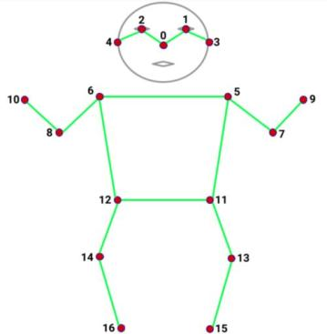

# Yolov8部署(https://github.com/ultralytics/ultralytics)  
## det:  
输入640 * 640 * 3， 输出 1 * 84 * 8400  
yolov8 是anchor-free，84=4+80， 4是检测框， 80是coco的80类别。  

## face：  
yolov8 face在yolov8主干上在三个分支产生人检测结果  
输入 640 * 640 * 3， 输出 1 * 80 * 80 * 80、  1 * 40 * 40 * 80、  1 * 20 * 20 * 80。  
80 = 64 + 1 + 15：  
* 64 = 16 * 4： 16可以简单理解为对每个网格细分为16个更小的网格，输出了每个位置的概率分布，通过加权平均得到这个网格的位置偏移量；  
* 1： 置信度；  
* 15 = 5 * 3： 5个关键点坐标和置信度；  

## pose:
yolov8 pose在检测的head基础上，添加了三个分支，用于预测关键点，检测人体关键点，cls改为1，模型通过官方训练权重导出。  
输入 640 * 640 * 3 输出 1 * 56 * 8400  
56 = 4 + 1 + 51  
* 4 + 1： 检测框+置信度  
* 51 = 17 * 3： coco人体17关键点，x y score  
coco 17关键点分布如下：  

